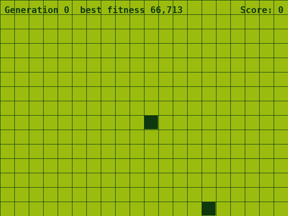
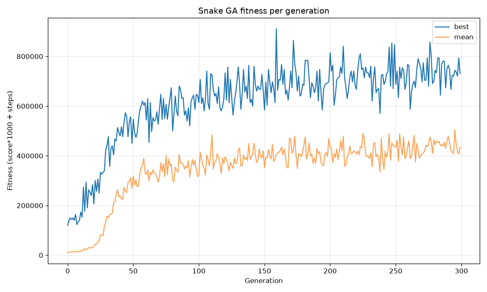

# Snake GA — a genetic algorithm learns to play Snake

A Nokia-style Snake game plus a genetic algorithm that evolves a tiny neural
network to play it. No gradient descent, no reinforcement learning — just
tournament selection, crossover, and mutation over the network's weights.



*Watching evolution happen: the best snake of generations 0, 2, 5, 10, 20 and 39.
Early snakes wander in circles; within a few dozen generations they hunt food
efficiently.* (Higher-quality [MP4 here](media/training.mp4).)

## Results

The trained agent (`results/best.npy`) averages **455 points over 20 unseen
games** (min 150, max 760) — that's ~45 foods per game on a 20×15 grid. The
target was 200.



## How it works

**The game** (`engine.py`) is a headless, seedable engine: 20×15 toroidal grid
(walls wrap), only self-collision kills, food +10, occasional 2×2 bonus +50.
The pygame front-end (`snake.py`) is still fully human-playable.

**The agent** (`agent.py`) sees just 6 numbers, all relative to its heading so
the policy is rotation-invariant:

| # | Feature |
|---|---------|
| 0–2 | danger one cell ahead / left / right (own body) |
| 3–4 | signed toroidal distance to food, forward and rightward |
| 5 | snake length / grid area |

These feed a fixed-topology net — `6 → 16 (tanh) → 3` — whose argmax output is
the action: turn left, go straight, or turn right. The genome is the flat
vector of all 227 weights and biases.

**Evolution** (`train.py`):

- Population 200, each genome scored as the mean over 3 seeded games of
  `score × 1000 + steps survived` (the steps term gives early random snakes a
  gradient; a starvation cap kills infinite loopers)
- **Tournament selection** (size 5), elitism (top 2 copied unchanged)
- BLX-α crossover, per-gene Gaussian mutation (rate 0.05, σ 0.3)
- Evaluation parallelised across cores with `multiprocessing`

The target (mean ≥ 200) was passed by generation ~27; by 300 generations the
best snakes score 700+ in training games.

## Quick start

Requires Python 3.13+ and [uv](https://docs.astral.sh/uv/)/pip. On Python
3.14 use `pygame-ce` (upstream pygame 2.6 is broken there):

```bash
python -m venv .venv
.venv/bin/pip install pygame-ce numpy matplotlib pytest
```

Watch the trained agent play:

```bash
.venv/bin/python watch.py results/best.npy --seed 1 --fps 10
```

Play it yourself:

```bash
.venv/bin/python snake.py
```

Train from scratch (~15 min on 8 cores):

```bash
.venv/bin/python train.py --pop 200 --generations 300 --out runs/mine
```

Watch training live — replays each generation's best snake in a window as it
evolves:

```bash
.venv/bin/python train.py --pop 100 --generations 150 --render --render-fps 40
```

Evaluate and plot:

```bash
.venv/bin/python evaluate.py runs/mine/best.npy --games 20 --threshold 200
.venv/bin/python plot_fitness.py runs/mine/fitness.csv
```

Run the tests (26):

```bash
.venv/bin/python -m pytest tests/ -q
```

## Project layout

```
engine.py          headless game rules (no pygame, seedable, deterministic)
snake.py           human-playable pygame front-end
agent.py           observation builder + neural net
train.py           GA training loop (tournament selection)
render_gen.py      live replay window used by train.py --render
watch.py           replay a saved genome
evaluate.py        score a genome over N games
plot_fitness.py    fitness.csv -> fitness.png
record_training.py capture training frames for the video above
results/           trained genome + fitness history
tests/             pytest suite for engine and agent
```

## CLI reference (train.py)

| Flag | Default | Meaning |
|------|---------|---------|
| `--pop` | 200 | population size |
| `--generations` | 300 | generations to run |
| `--tournament` | 5 | tournament size |
| `--elitism` | 2 | genomes copied unchanged |
| `--mutation-rate` | 0.05 | per-gene mutation probability |
| `--mutation-sigma` | 0.3 | mutation noise σ |
| `--workers` | all cores | parallel evaluation processes |
| `--seed` | 0 | master RNG seed |
| `--render` | off | show each generation's best in a window |
| `--render-every` | 1 | replay every Nth generation |
| `--out` | `runs/<timestamp>` | output directory |
